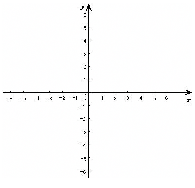
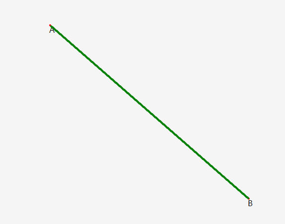

# 一元一次方程
> 一元一次方程（linear equation with one unknown），只含有一个未知数、未知数的最高次数为1且两边都为整式的等式叫做一元一次方程，使方程左右两边的值相等的未知数的值，叫做方程的解（solution）也叫做方程的根。其标准形式为 ax = b（a≠0），一般形式为 ax + b = 0（a ≠ 0）。[百度百科](http://baike.baidu.com/link?url=KMueA0DyFaffyqqkjnZ8-su9XKAXV7lFke5SmZxb82M6pW-rR6tq3g4zrrQ47_q67vHGwltAT37HY6kk7zMZHkr2Xu_xGS7V3xnE6_cPBfQx9F61DedaFIYof_pSt6wGd0p45YXNHsIvWdpRjUpnna)

* 满足条件
    * 该方程为整式方程
    * 该方程有且只含有一个未知数。化简后未知数系数不为0。
    * 该方程中未知数的最高次数是1。


上面的公式我们可以看成是一个一次函数，y = ax + b；只不过这里的 y = 0，也就是说 ax + b = 0。一次函数 y = ax + b 可以使用平面直角坐标系表示。如下图。



那么 ax + b = 0 表示的就是垂直于 x 轴的一条直线。那么在实际开发中会用到这样的东西吗？答案是肯定的，尤其是涉及到一些像直线的计算，绘图等功能是用到的。下面使用一个简单的小栗子来看看这个一次函数的运用。如下图：已知页面上有两点 A、B，请用直线连接AB两点。（先用几秒时间思考下，怎么做？:smile:）


HTML结构：
```html
<span class="dot a" id="dot-a">A</span>
<span class="dot b" id="dot-b">B</span>
```

CSS样式：
```css
*{
    padding: 0;
    margin: 0;
}
html, body{
    background: #f5f5f5;
}
.dot{
    width: 4px;
    height: 4px;
    display: inline-block;
    -webkit-border-radius: 50%;
    -moz-border-radius: 50%;
    -ms-border-radius: 50%;
    -o-border-radius: 50%;
    border-radius: 50%;
    background: red;
    position: absolute;
}
.a{
    left: 100px;
    top: 50px;
}
.b{
    left: 500px;
    top: 400px;
}
.line{
    background: green;
}
```

咱们先来温习一下知识点：函数 y = ax + b 是直线的标准公式，a 表示的是直线的斜率，而两点之间的直线斜率 a = (y2 - y1)/(x2 - x1)；我们已经知道了A、B两点，那么就能求得 a 斜率是多少，那么 b 也自然而然求出来了。

我们先让A点表示为(x1, y1)，B点为(x2, y2)；在JavaScript中获取元素的位置信息，用`getBoundingClientRect`方法，它返回元素的`width、height、left、top、right、bottom`。下面开始上代码：

```javascript
var A = document.getElementById('dot-a');
var B = document.getElementById('dot-b');

var ARect = A.getBoundingClientRect();
var BRect = B.getBoundingClientRect();

//y = ax + b;
//a = (y2 - y1)/(x2 - x1);

var a = (-BRect.top - (-ARect.top)) / (BRect.left - ARect.left);
var b = -ARect.top - a * ARect.left;


//开始画线
var i = ARect.left + ARect.width / 2;
var fragment = document.createDocumentFragment();

for(; i < BRect.left; i++){
    var dot = document.createElement('span');
    var y = Math.abs(a * i + b);

    dot.className = 'dot line';
    dot.style.left = i + 'px';
    dot.style.top = y + 'px';

    fragment.appendChild(dot);
}

document.body.appendChild(fragment);
```
最终的效果如下图：



注意：由于这里将网页的左上角看成是坐标系中的(0, 0)原点，所以要将两点的 y 值变成负的，而最后生成点`dot`的时候又要将 y 值变成正的，来显示在网页中。你秒懂了么？:wink: