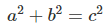
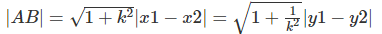

# 求两点之间的距离
看到标题仿佛想起以前数学课堂的美好回忆啊，有木有？还真是！我的数学一直很菜，到现在很多知识点基本就忘光了。:joy:

言归正传，求两点之间的距离，我们先要展开一下想象。在网页中，我们可以将整张网页看成是在一个平面直角坐标系中，如果将网页的左上角看成是坐标系中的 (0, 0) 原点，那么整张网页就相当于在第四象限内了。（在脑海中想象一下）。

而网页中的每个元素都有自己对应的位置`left`、`top`，分别对应的是坐标中的 x、y 值。例如下图：


### 勾股定理
页面中有 AB 两个点，那么我们设两点坐标 A(x1, y1)、B(x2, y2)。我们可以将 AB 的连线看成是直角三角形的斜边，图中 C 为直角三角形的直角。现在我们已知 A、B 两点的坐标，那么边长 BC 就是 |x1 - x2|，边长 AC 就是 |y1 - y2|。

那么根据[勾股定理](http://baike.baidu.com/link?url=ciDltiPXjII5DYE-KByq5G3rYWueLBOpMwDz3BjgfzRVvmI2YX0KP7CzmNNnke2KUJgMwpbq13of5U1alv1fA_dK37sAENPWmAg0NyjTNOckFDtfGeWoeSRVQ7SMbVWv)，斜边 AB 就求得公式为 。

公式已经知道了，下面用代码的形式写出来：

```javascript
function getDistanceBetweenTwoPoints(x1, y1, x2, y2){
    var a = x1 - x2;
    var b = y1 - y2;
    
    // c^2 = a^2 + b^2
    // a^2 = Math.pow(a, 2)
    // b^2 = Math.pow(b, 2)
    var result = Math.sqrt(Math.pow(a, 2) + Math.pow(b, 2));

    return result;
}
```

`Math.sqrt`方法是求平方根，`Math.pow(n, 2)`是求一个数的平方。上面的的方法就是根据两点的坐标求得两点的距离。

### 一次函数
除了根据勾股定理之外，我们还可以根据一次函数的来得到斜边的长度，将斜边 AB 看成一个一次函数 y = kx + b，将 A、B 两点的坐标代入，我们就可以得到。这里面详细的运算过程请看客自己计算，这里就不多唠叨了。

到这里真是感叹，数学真是博大精深啊，古人诚不欺我！