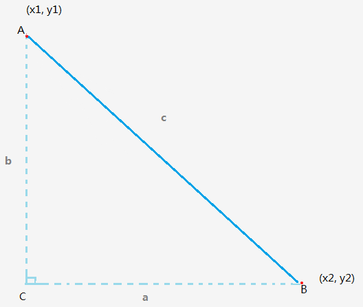
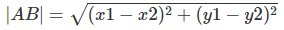
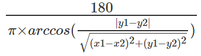

# 求直角三角形的角度
在数学中我们经常遇见求莫个三角形的角度等问题，这篇文章来聊聊求直角三角形的角度。数学中有一个东西叫[三角函数](https://zh.wikipedia.org/wiki/%E4%B8%89%E8%A7%92%E5%87%BD%E6%95%B0)，而与之对应的一个叫[反三角函数](https://zh.wikipedia.org/wiki/%E5%8F%8D%E4%B8%89%E8%A7%92%E5%87%BD%E6%95%B0)。

常见的三角函数包括正弦函数（sin）、余弦函数（cos）和正切函数（tan），与其对应的反三角函数是反正弦函数（arcsin）、反余弦函数（arccos）和反正切函数（arctan）。这三类算是最常见的了，当然还有其它的余切、正割啊什么的。这里面需要计算直角三角形的角度，例如下面这张图：



我们需要计算角 A 的角度是多少。JavaScript中 `Math.asin`是求反正弦值，`Math.acos`是求反余弦值，，`Math.atan`是求反正切值。

| 反函数 |    名称    |  弧度值范围  |
|:------|:----------|:--------------------:|
| asin   | 反正弦值   | -PI/2 到 PI/2 |
| acos   | 反余弦值   |   0 到 PI   |
| atan   | 反正切值   | -PI/2 到 PI/2  |

它们返回的是一个弧度值，而既然我们知道了弧度值那么角度是不是就求出来了呢，弧度转角度。都是知识点啊！（我偷偷地翻了翻以前的数学课本 :blush:）

弧度变角度的公式为：180 / π × 弧度，那么在网页中（将网页左上角看成 (0, 0)原点的平面直接坐标系）我们设 A、B 两点的坐标信息为：
```css
.A{
    left: 100px;
    top: 50px;
}
.B{
    left: 500px;
    top: 400px;
}
```
将网页看成是坐标，那么整张网页就位于直接坐标系中的第四象限，那么 AB 两点用坐标表示为：A(100, -50)、B(500, -400)。下面好戏上场！

要想求得角 A 的度数，我们可以使用三角函数的定理。如图，那么我们根据三角函数的概念来推理：
```javascript
var cosA = b / c;
var A = 0;//点 A 对应的弧度

/*
A = arccos( consA )

A = arccos( b / c )
*/

A = Math.acos( b / c );

//弧度转角度 -> 180 / π × 弧度
var angleA = 180 / Math.PI * A;

angleA = 180 / Math.PI * Math.acos( b / c );
```
上面 a、b、c 分别表示的是三角形的三边。接下来不难看出，要想计算角 A 的度数，先得计算斜边 c 和临边 b 的长度。b 的长度很好求，就是 AB 两点的 y 坐标值（top）相减就得到了。而我们已经知道了 AB 两点的坐标，也就能根据两点坐标公式求斜边 c 的长度。

求两点距离公式为：


最后得到角度公式：

```javascript
var x1 = 100;
var y1 = -50;
var x2 = 500;
var y2 = -400;

var b = Math.abs(y1 - y2);//求b 边长度
var c = Math.sqrt(Math.pow(x1 - x2, 2) + Math.pow(y1 - y2, 2));//求c 边长度

var radianA = Math.acos(b / c);//求弧度

var angleA = 180 / Math.PI * radianA;//弧度转角度

angleA = Math.round(angleA);//49
```

这样角 A 的度数就求出来了~ 大功告成！最后将其整理成一个求角度的函数
```javascript
var getAngle = function(A, B){
    var x1 = A.x;
    var y1 = A.y;
    var x2 = B.x;
    var y2 = B.y;

    var a = Math.abs(x1 - x2);
    var b = Math.abs(y1 - y2);

    if(a === 0 || b === 0){
        throw new Error('该两点相交的直线无法与水平轴或垂直轴构成三角形');
    }

    var c = Math.sqrt(Math.pow(a, 2) + Math.pow(b, 2));

    var randianToAngle = function(scale){
        var radian = Math.acos(scale);

        var angle = 180 / Math.PI * radian;

        return Math.round(angle);
    }

    var angleA = randianToAngle(b / c);
    var angleB = randianToAngle(a / c);

    return {
        A: angleA,
        B: angleB,
        C: 90
    }
}
```
上面函数是基于网页中的两点，来求两点相交直线与水平轴和垂直轴的角度（形成直角三角形，直角位于直线下方）。用 AB 两点测试一下上面的方法：
```javascript
var A = { x: 100,y: -50 };
var B = { x: 500, y: -400};

getAngle(A, B)//{A: 49, B: 41, C: 90}
```
结果也是妥妥的~

上面是用余弦函数来计算的，当然也可以用正弦函数来计算了。这里之所以用余弦函数，那是因为角 A 的两条边是 b 和 c，这样计算起来更加方便。有兴趣的可以研究用正弦函数 sinA = a / c，来试试！